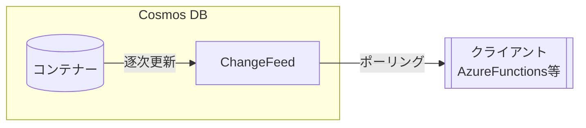
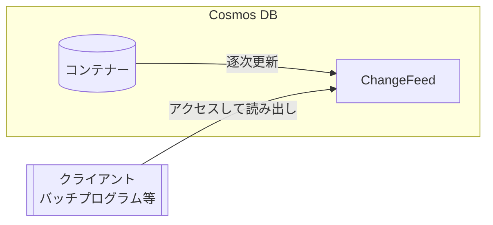
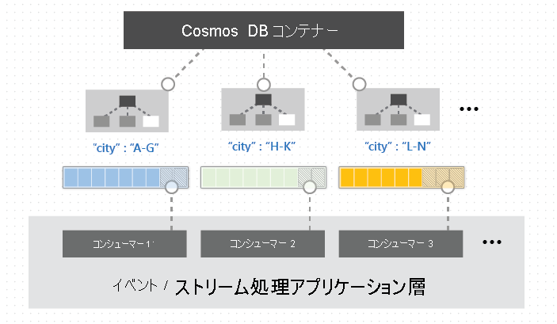
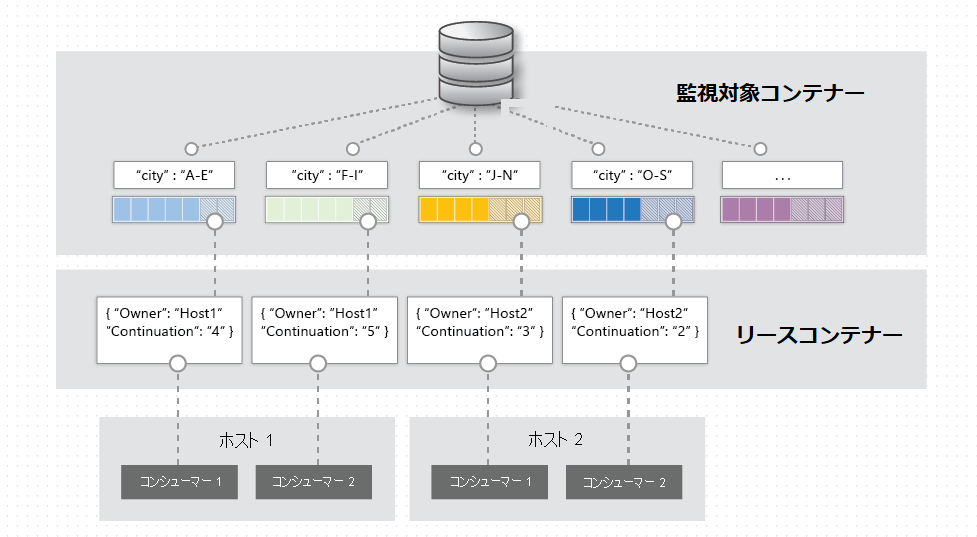

# Change Feed 概要

[目次に戻る](./readme.md)

## Change Feedとは？
  Change Feed(変更フィード)はCosmos DB for NoSQLの**コンテナーに対して行われた変更の永続的な記録**である。
  変更されたドキュメントは変更された順に並べ替えられた一覧に出力される。  
  非同期的に増分処理できる。  
  出力を複数のコンシューマー(クライアント)に分散させて並列処理することもできる。

## 対応するSDK
  以下のSDKに対応する。
  - .NET **(本ハンズオンではC#+.NETを利用)**
  - Java
  - Python
  - Node/JavaScript
 
## Change Feedの操作

使い方には以下のオプションがある。

|利用法|タイプ|概要|注意点|
|---|---|---|---|
|Azure Functions CosmosDBトリガー|プッシュモデル|Azure FunctionsのCosmos DBトリガーで処理|使いやすい(本ドキュメントでも以降はFunctionsに限定して説明)|
|変更フィードプロセッサの使用|プッシュモデル|独自アプリケーションで、待ち受けオブジェクトを作り、変更が来るたびに動作するプログラムを書く|実際はポーリングしている|
|プルモデル|プルモデル|既存の変更フィードに直接アクセスし、内容を取得する|クライアントが処理ペースを決めたい、データ移行などに使う|

### プッシュモデルとプルモデル

*プッシュモデル

*プルモデル

### パーティション範囲ごとの並列処理

Change Feedはコンテナーのパーティションキー範囲(パーティションのグループ)で使用できる。  
これにより次の図のように1つ、または複数のコンシューマーに分散して並列処理ができる。

## Change Feedのモード

### 最新バージョンモード

- フィード内のすべての項目の挿入、または最新の変更が表示される。削除はキャプチャされず、挿入・変更の違いも示されない。  
- 変更はコンテナーの始まりまでさかのぼって任意の時点から読み取ることができるが、項目が削除されるとChange Feedからも削除される。

### すべてのバージョンと削除モード(プレビュー)

- 作成・更新・削除による項目へのすべての変更が確認できる。
- 変更途中のバージョンを得ることもできる。
- 継続的バックアップが設定されていることが条件
    - 継続的バックアップの期間内の変更がキャプチャされる
- プレビュー参加には**申請が必要**となる (2023/07時点)

## 仕組み

- 監視対象コンテナーに対する挿入と変更がChange Feedに記録される。  
- Change Feedに対する複数のコンシューマーの処理をリースコンテナーに記録された情報で進行状況を管理する  
- コンシューマーとしてAzure Functionsや独自のクライアントなどがChange Feedに対してアクセスにくる

この仕組みの中で追加でコストがかかるのは  
- リースコンテナーのスループット(RU/s)  
- コンシューマーの稼働コスト(Azure Functions等クラウドサービスの場合)  
である。監視対象コンテナーや、Change Feedそのものにコストはかからない。

## Azure Functionsを使ったCosmos DB Change Feedの利用

### Azure Functionsとは？(超概要)

Azure FunctionsはAzureにおける**サーバーレス型アプリケーション基盤を提供するサービス**である。  
利用者はサーバー構築・運用の手間をかけず、アプリケーションの記述のみでクラウド上で**入出力をもつ関数(Function)を定義・運用できる**。

### Azure Functionsの特長

|特長|詳細|
|----|----|
|トリガー|タイマー起動、HTTPアクセスによる起動、ファイル配置による起動、データ更新による起動など、アプリケーションを起動するイベント(トリガー)を多種用意している。
|入出力バインド|データベースやファイルストレージなどを簡単にアプリケーションに紐づけし、アプリケーションに対する入出力を定義・利用することができる|
|多くの開発言語に対応|C#(.NET),Python,PowerShell,Java,JavaScriptなど多くの言語に対応|
|バリエーションのある動作・課金モデル|従量課金と常時起動型を選択できる。|

### Azure Functionsを用いたサーバーレス開発

Azure Functionsを用いたアプリケーション開発は以下の3つの方式で行うことができる。

|方式|概要|
|---|---|
|Visual Studio|Visual StudioにAzure開発ワークロードを含めて開発プロジェクトを作成する|
|Visual Studio Code|VS Code+AzureFunctions拡張機能を用いて開発する|
|Azure Portal|Azure Portal上のツールを使って開発する 開発できる言語・環境が限定される(C#スクリプトベースの場合はWindowsプラットフォームが必須)
