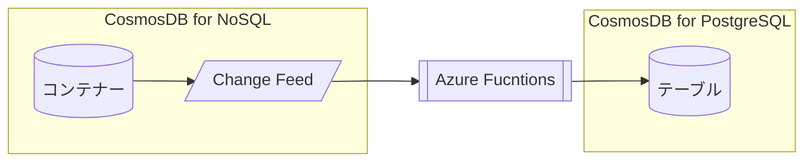

# Azure Functionsを利用したCosmos DB Change Feedの操作

[目次に戻る](./readme.md)

## 前提条件

- Cosmos DB for NoSQLのアカウント・データベース・コンテナーの作成ができること
- Cosmos DB for PostgreSQLのアカウントの作成ができること

## Azure Functionsの作成

本ハンズオンでは、**Windows**プラットフォームで動作するAzure Functionsを新たに作成する。  
※WindowsプラットフォームのAzure FunctionsはAzure Portal上でコードを作成・変更できる。

- Azure Portalを開く
- Azure Functions "関数アプリ" を検索し、作成 

以下のように設定する。

|項目|値|
|---|---|
|サブスクリプション|任意|
|リソースグループ|任意|
|関数アプリ名|任意(全世界で一意)|
|ランタイムスタック|.NET|
|バージョン|6(LTS)|
|地域|任意(JapanEast推奨)|
|オペレーティングシステム|Windows|
|ホスティングオプションとプラン|消費量(サーバーレス)|


<br>


## 関数の作成

### 1. CosmosDBから受信したレコードの情報をログに表示

- Azure Portalから関数アプリを開き、新規作成


- "ポータルでの開発" , "Azure Cosmos DB Trigger"を選択し、作成


- 関数エディターを表示する
- 以下のコードをコピーし、貼り付ける
- Cosmos DBのデータエクスプローラーから

### 2. CosmosDBから受信したレコードをCosmos DB for PostgreSQLのテーブルに書き込む



#### 事前準備 : Cosmos DB for PostgreSQL上にテーブルを作成

- ‼️ CosmosDB for PostgreSQLのネットワーク設定で、"Allow public access from Azure services and resources within Azure to this cluster"にチェックが入っていることを確認する


- Cosmos DB for PostgreSQLのpSQLインターフェースで下記のテーブルを作成する。

> psqlはAzurePortal上でCloud Shellを起動して実行する

```SQL
create table holfnctest (
  id varchar(16),
  name varchar(64),
  age bigint,
  other jsonb
);
```

#### 関数の作成

#### テスト

- Cosmos DB for NoSQLアカウント側で下記のアイテムを作成する
- 
