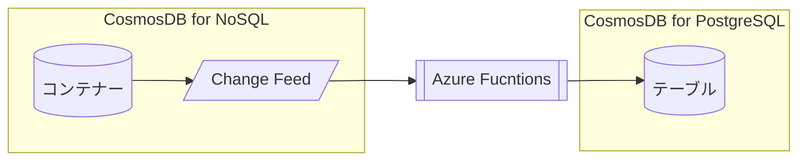

# Azure Functionsを利用したCosmos DB Change Feedの操作

[目次に戻る](./readme.md)

## 前提条件

- Cosmos DB for NoSQLのアカウント・データベース・コンテナーの作成ができること
- Cosmos DB for PostgreSQLのアカウントの作成ができること

## Azure Functionsの作成

本ハンズオンでは、**Windows**プラットフォームで動作するAzure Functionsを新たに作成する。  
※WindowsプラットフォームのAzure FunctionsはAzure Portal上でコードを作成・変更できる。

- Azure Portalを開く
- Azure Functions "関数アプリ" を検索し、作成 

以下のように設定する。

|項目|値|
|---|---|
|サブスクリプション|任意|
|リソースグループ|任意|
|関数アプリ名|任意(全世界で一意)|
|ランタイムスタック|.NET|
|バージョン|6(LTS)|
|地域|任意(JapanEast推奨)|
|オペレーティングシステム|Windows|
|ホスティングオプションとプラン|消費量(サーバーレス)|


<br>


## 関数の作成

### 1. CosmosDBから受信したレコードの情報をログに表示

- Azure Portalから関数アプリを開き、新規作成


- "ポータルでの開発" , "Azure Cosmos DB Trigger"を選択


- Cosmos DB Account Connectionは"New"をクリックし、Azure Cosmos DBアカウントを選択し、対象のCosmos DBアカウントを選択して"OK"


- その他は下記のように入力・選択する

|項目|値|
|---|---|
|Database Name|(利用するデータベース名)|
|Container Name|(コンテナー名)|
|Collection for lease|lease(デフォルト)|
|Create lease collection if it does not exist|**はい**|

- 作成を押下して関数アプリを作成する

- "コードとテスト"から関数エディターを表示する


- 以下のコードをコピーし、貼り付ける

```CSharp
#r "Microsoft.Azure.DocumentDB.Core"
using System;
using System.Collections.Generic;
using Microsoft.Azure.Documents;

public static void Run(IReadOnlyList<Document> input, ILogger log)
{
    if (input != null && input.Count > 0)
    {
        log.LogInformation("Documents modified " + input.Count);
        log.LogInformation("First document Id " + input[0].Id);
    }

    foreach ( var doc in input ) {
        var jsonString = doc.ToString();

        log.LogInformation("jsonString : " + jsonString);

    }
}
```

- Cosmos DBのデータエクスプローラーから下記のデータを新規に作成する(内容は任意に変更してもよい)

```JSON
{
  "id":"01234",
  "name":"John Smith",
  "age": 23
}
```

- Azure Functionsの関数エディタ、左メニューの"モニター"を確認する(ログ反映に5分ほどかかることがある)


- 該当する時間をクリックするとログが表示される


### 2. CosmosDBから受信したレコードをCosmos DB for PostgreSQLのテーブルに書き込む



#### 事前準備 : Cosmos DB for PostgreSQL上にテーブルを作成

- ‼️ CosmosDB for PostgreSQLのネットワーク設定で、"Allow public access from Azure services and resources within Azure to this cluster"にチェックが入っていることを確認する


- Cosmos DB for PostgreSQLのpSQLインターフェースで下記のテーブルを作成する。

> psqlはAzurePortal上でCloud Shellを起動して実行する

```SQL
create table holfnctest (
  id varchar(16),
  name varchar(64),
  age bigint,
  other jsonb
);
```

#### 関数の作成

#### テスト

- Cosmos DB for NoSQLアカウント側で下記のアイテムを作成する
- 
