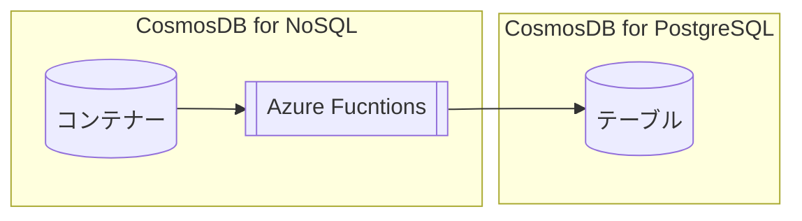

# Azure Functionsを利用したCosmos DB Change Feedの操作

[目次に戻る](./readme.md)

## 前提条件

- Cosmos DB for NoSQLのアカウント・データベース・コンテナー・アイテムの作成ができていること

## Azure Functionsの作成

本ハンズオンでは、**Windows**プラットフォームで動作するAzure Functionsを新たに作成する。  
※WindowsプラットフォームのAzure FunctionsはAzure Portal上でコードを作成・変更できる。

## 関数の作成

### 1. 受信したレコードの情報をログに表示

### 2. 受信したレコードをCosmos DB for PostgreSQLのテーブルに書き込む

#### 事前準備 : Cosmos DB for PostgreSQL上にテーブルを作成

#### 関数の作成

#### テスト
