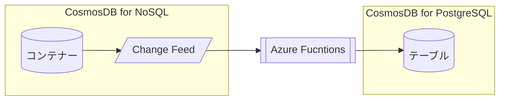

# Azure Functionsを利用したCosmos DB Change Feedの操作

[目次に戻る](./readme.md)

## 前提条件

- Cosmos DB for NoSQLのアカウント・データベース・コンテナーの作成ができること
- Cosmos DB for PostgreSQLのアカウントの作成ができること

## Azure Functionsの作成

本ハンズオンでは、**Windows**プラットフォームで動作するAzure Functionsを新たに作成する。  
※WindowsプラットフォームのAzure FunctionsはAzure Portal上でコードを作成・変更できる。

- Azure Portalを開く
- Azure Functionsを検索し、作成

## 関数の作成

### 1. CosmosDBから受信したレコードの情報をログに表示

- Azure Portalから関数アプリを開く
- 関数エディターを表示する
- 以下のコードをコピーし、貼り付ける
- Cosmos DBのデータエクスプローラーから

### 2. CosmosDBから受信したレコードをCosmos DB for PostgreSQLのテーブルに書き込む




#### 事前準備 : Cosmos DB for PostgreSQL上にテーブルを作成

Cosmos DB for PostgreSQLのpSQLインターフェースで下記のテーブルを作成する。

```SQL
```

#### 関数の作成

#### テスト

- Cosmos DB for NoSQLアカウント側で下記のアイテムを作成する
- 
