# Azure Functionsを利用したCosmos DB Change Feedの操作

[目次に戻る](./readme.md)

## 前提条件

- Cosmos DB for NoSQLのアカウント・データベース・コンテナーの作成ができること
- Cosmos DB for PostgreSQLのアカウントの作成ができること

## Azure Functionsの作成

本ハンズオンでは、**Windows**プラットフォームで動作するAzure Functionsを新たに作成する。  
※WindowsプラットフォームのAzure FunctionsはAzure Portal上でコードを作成・変更できる。

- Azure Portalを開く
- Azure Functions "関数アプリ" を検索し、作成 

以下のように設定する。

|項目|値|
|---|---|
|サブスクリプション|任意|
|リソースグループ|任意|
|関数アプリ名|任意(全世界で一意)|
|ランタイムスタック|.NET|
|バージョン|6(LTS)|
|地域|任意(JapanEast推奨)|
|オペレーティングシステム|Windows|
|ホスティングオプションとプラン|消費量(サーバーレス)|

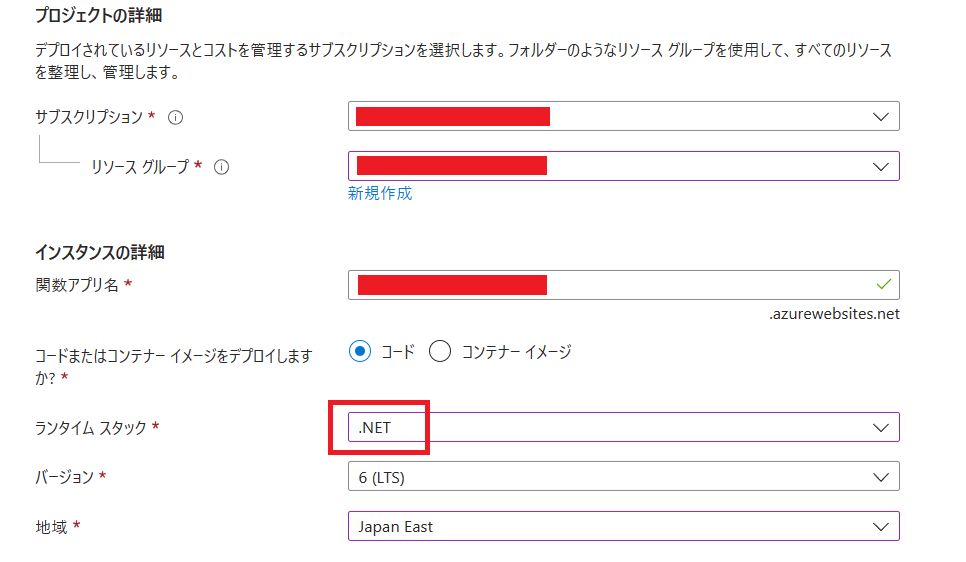
<br>
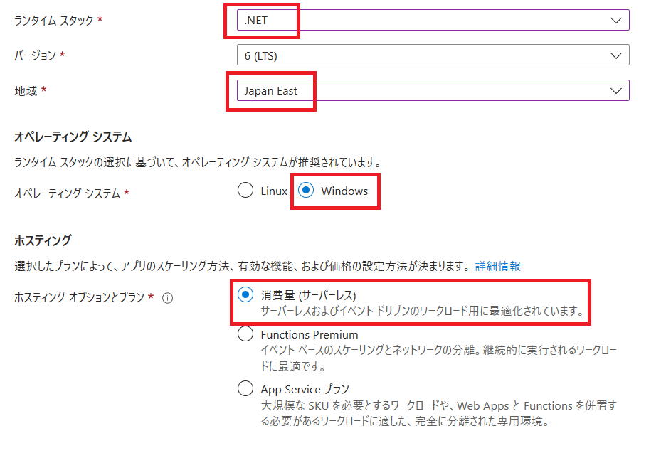


## 関数の作成

### 1. CosmosDBから受信したレコードの情報をログに表示

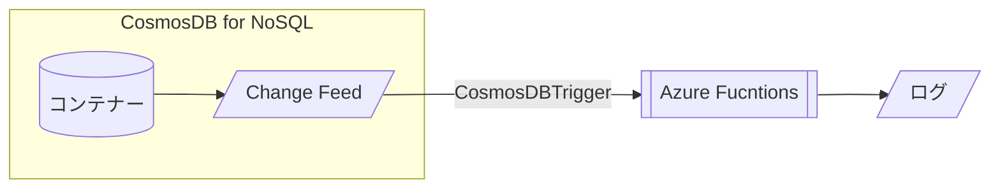

#### 関数の作成

- Azure Portalから関数アプリを開き、新規作成

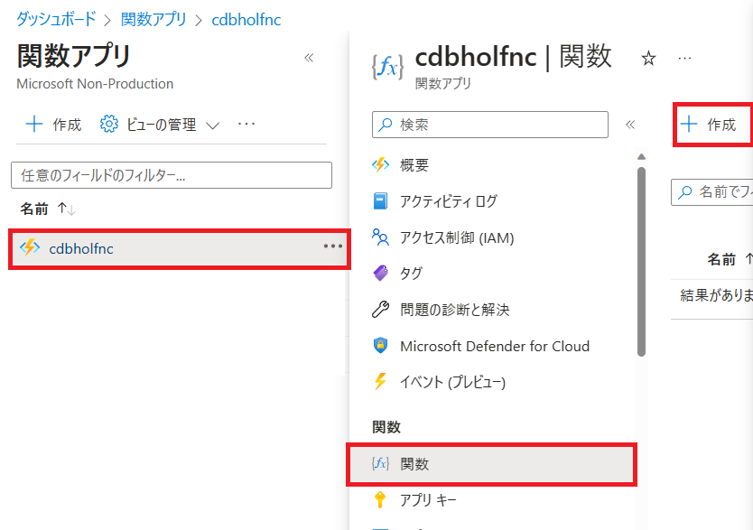

- "ポータルでの開発" , "Azure Cosmos DB Trigger"を選択

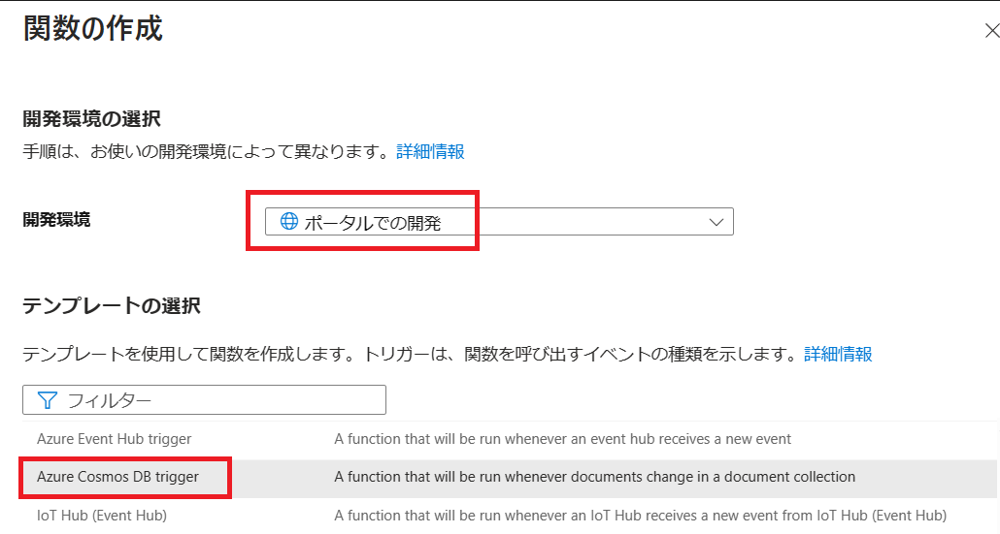

- Cosmos DB Account Connectionは"New"をクリックし、Azure Cosmos DBアカウントを選択し、対象のCosmos DBアカウントを選択して"OK"

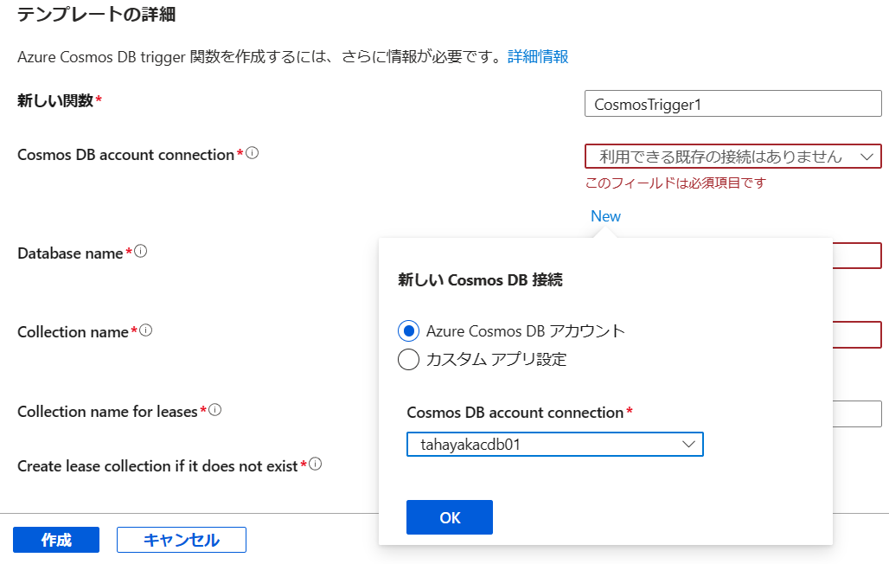

- その他は下記のように入力・選択する

|項目|値|
|---|---|
|Database Name|(利用するデータベース名)|
|Container Name|(コンテナー名)|
|Collection for lease|lease(デフォルト)|
|Create lease collection if it does not exist|**はい**|

- 作成を押下して関数アプリを作成する

- "コードとテスト"から関数エディターを表示する

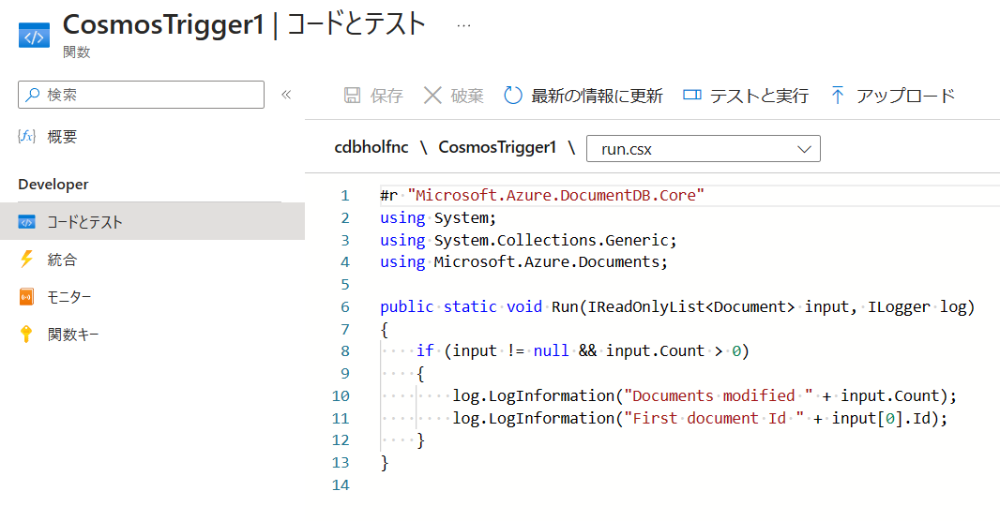

- 以下のコードをコピーし、貼り付けて、「保存」
  - 初期のコードからは`foreach ( var doc in input ) {`以降のブロックを追記すればよい

```CSharp
#r "Microsoft.Azure.DocumentDB.Core"
using System;
using System.Collections.Generic;
using Microsoft.Azure.Documents;

public static void Run(IReadOnlyList<Document> input, ILogger log)
{
    if (input != null && input.Count > 0)
    {
        log.LogInformation("Documents modified " + input.Count);
        log.LogInformation("First document Id " + input[0].Id);
    }

    foreach ( var doc in input ) {
        var jsonString = doc.ToString();

        log.LogInformation("jsonString : " + jsonString);

    }
}
```

#### 関数のテスト

- ブラウザのタブをもう１つ起動し、Azure Portalの関数アプリ内メニューの「ログストリーム」を表示しておく
  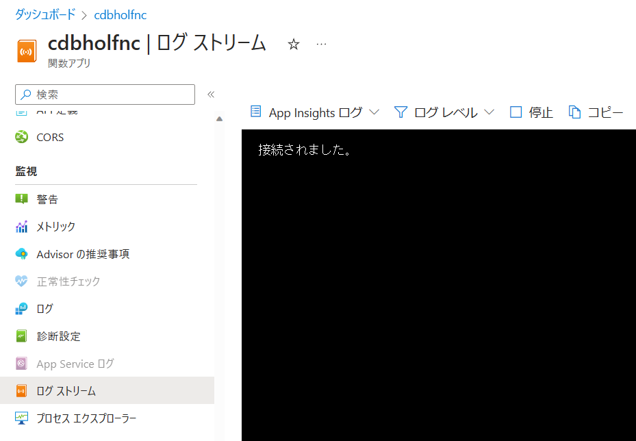

- Cosmos DBのデータエクスプローラーから下記のデータを新規に作成する(内容は任意に変更してもよい)

```JSON
{
  "id":"01234",
  "name":"John Smith",
  "age": 23
}
```

- ログストリームに変更内容が表示されることを確認する

- Azure Functionsの関数エディタ、左メニューの"モニター"を確認する(ログ反映に5分ほどかかることがある)

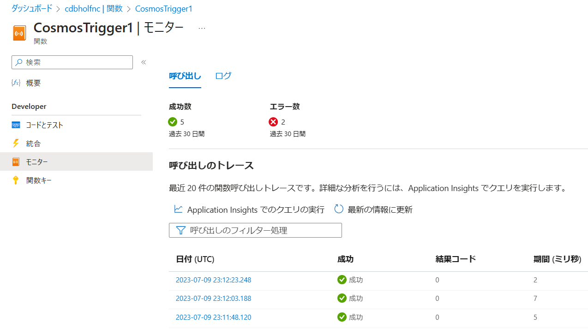

- 該当する時間をクリックするとログが表示される

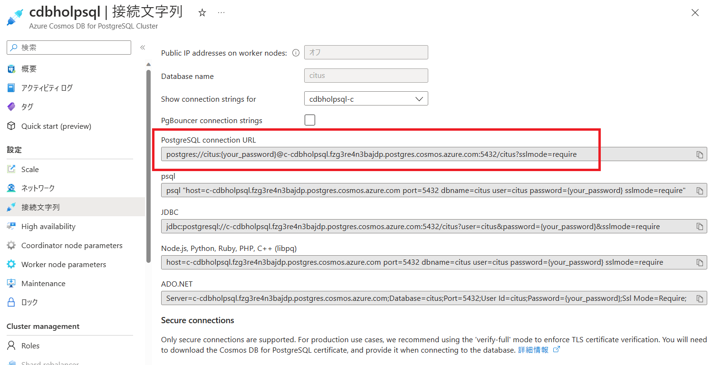

### 2. CosmosDBから受信したレコードをCosmos DB for PostgreSQLのテーブルに書き込む

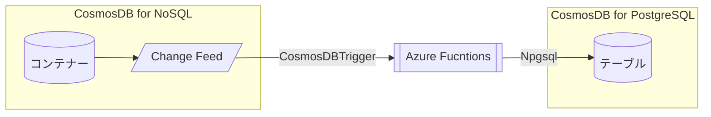

#### 事前準備 : Cosmos DB for PostgreSQL上にテーブルを作成

- ‼️ CosmosDB for PostgreSQLのネットワーク設定で、"Allow public access from Azure services and resources within Azure to this cluster"にチェックが入っていることを確認する

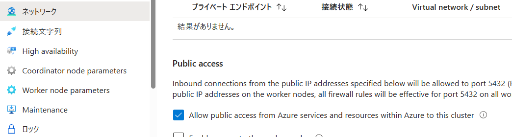

- Cosmos DB for PostgreSQLのpSQLインターフェースで下記のテーブルを作成する。

> psqlはAzurePortal上でCloud Shellを起動して実行する

```SQL
create table holfnctest (
  seq SERIAL not null,
  id varchar(16) not null,
  name varchar(64),
  age bigint,
  create_at timestamp,
  other jsonb
);

select create_distributed_table('holfnctest','id');
```

- Cosmos DB for PostgreSQLのメニュー「接続文字列」より、"PostgreSQL Connection String"をコピーしておく


- Npgsql(PostgreSQL接続用C#ライブラリ)の導入
    - 関数アプリのメニュー「高度なツール」内にある、App Services Editor(プレビュー)を選択し、「エディターを開く」をクリックする  
      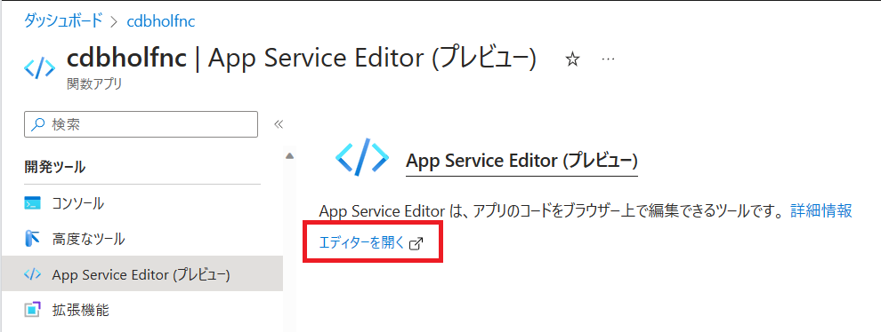
      
    - ComsomsDBTriggerフォルダで右クリックし、"NewFile"  
      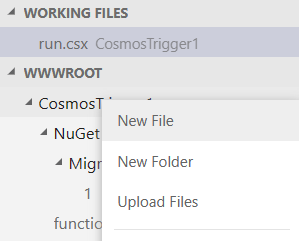
      
    - "functions.proj"というファイルを作成し、Npgsqlに関する下記エントリを記述する(自動で保存される)

```XML
<Project Sdk="Microsoft.NET.Sdk">
    <PropertyGroup>
        <TargetFramework>netstandard2.0</TargetFramework>
    </PropertyGroup>
    <ItemGroup>
        <PackageReference Include="Npgsql" Version="4.0.3" />
    </ItemGroup>
</Project>
```

> 関数アプリのコードを保存するとコンパイルが走るが、その際に必要なライブラリのインポートが実行される。

#### 関数の作成

- Azure Functionsのコードを以下のように設定する。  
  connStringの`<サーバーURL>`,`<パスワード>`は自分の環境に合わせて適宜入れ替える

```CSharp
#r "Microsoft.Azure.DocumentDB.Core"

using System;
using System.Collections.Generic;
using Microsoft.Azure.Documents;
using Npgsql;

public static void Run(IReadOnlyList<Document> input, ILogger log)
{

    var connString = "Server=<サーバーURL>;Port=5432;Database=citus;Username=citus;Password=<パスワード>;SSLMode=Prefer";
    var conn = new NpgsqlConnection(connString);
    conn.Open();

    foreach ( var doc in input ) {

        log.LogInformation(input[0].ToString());

        using var cmd = new NpgsqlCommand("INSERT INTO holfnctest (id,name,age,create_at) VALUES (@p1,@p2,@p3,@p4)", conn);

        var create_at = DateTime.Now;
        cmd.Parameters.AddWithValue("p1", doc.GetPropertyValue<string>("id"));
        cmd.Parameters.AddWithValue("p2", doc.GetPropertyValue<string>("name"));
        cmd.Parameters.AddWithValue("p3", doc.GetPropertyValue<int>("age"));
        cmd.Parameters.AddWithValue("p4", create_at);
        
        log.LogInformation("Throwing Database Command : id='" + doc.GetPropertyValue<string>("id") + "' Start...");
        log.LogInformation("create_at will be '" + create_at.ToString() + "'.");

        var ret = cmd.ExecuteNonQuery();
        
        log.LogInformation("Throwing Database Command Ended. ret=[" + ret + "].");
        
    }
}
```

#### テスト

- Cosmos DB for NoSQLアカウント側で下記のアイテムを作成する、もしくは既存のアイテムを更新する

※このハンズオンで作成した関数では、idが同じ場合でも**データを追記する**

```JSON
{
    "id": "00001",
    "name": "Satya Nadella",
    "age": 55
}
```

```JSON
{
    "id": "00002",
    "name": "Amy Hood",
    "age": 51
}
```

```JSON
{
    "id": "00003",
    "name": "Judson Althoff",
    "age": 50
}
```

- Cosmos DB for PostgreSQL にpsqlでアクセス後、`select * from holfnctest;`を実行し、データが反映されていることを確認する

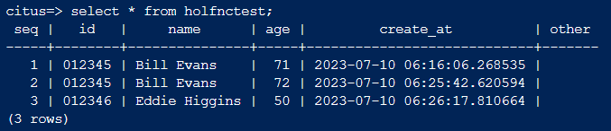

## 実装上の考慮点(ハンズオンとの比較)

### 開発言語・開発ツール
- 今回はAzure Portalへのアクセスへの利便性**だけ**を考慮して、Windows環境(Portal開発)を選択している。
    - クライアントから開発環境へのネットワークアクセスが取れるのであれば以下ツールによる開発も実施可能
        - Visual Studio
              - ライセンスが必要だが、最も開発しやすい
        - Visual Studio Code + 拡張機能
              - コマンドライン操作などがあるが、デバッグやローカル開発ができる

- Cosmos DB SDKはC#(.NET)が最も高機能かつ最新版の提供が速い。以降、Java > Python = JavaScript > Go となる。

### デバッグ
- Portal開発はデバッグしづらい・・・
    - コード保存時にコンパイルが走るので、コンパイルエラーならログストリームを見ればわかる
        
    - 逆にDBエラーなどはログストリームでは分からない → Application Insightsのログクエリで分かる
      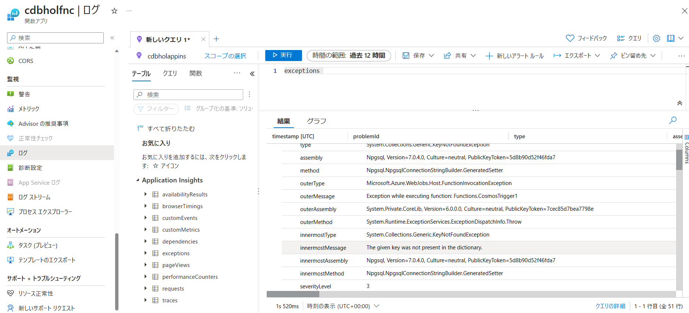

### アプリケーション
- エラーハンドリング
  - 本ハンズオンではエラーハンドリングを組み込んでない
      - サービスへのアクセス不可が続いたときの例外
      - (CosmosDBへ書き戻す場合) スループット超過(HTTP429)によるリトライロジック
          - 一定回数までのリトライはSDKを利用している場合は自動的に対応する 

- パスワード・接続文字列の隠ぺい
  - 本ハンズオンではDB接続文字列・パスワードをソース内に記述していたが、実開発では重要情報をソースに持たないようにすべき
    - Funcitons/Web Appsなどは、環境変数として登録することができる
    - マネージドIDが使えるサービスであれば、そちらを推奨

- UPDATE or INSERT?
  - 本ハンズオンではすべて「追記」とした 
  - UPDATEが必要なケースでは、UPSERT(UPdate or inSERT)ロジックを組み込む必要がある
    - キー項目でデータを検索して存在すればUPDATE、なければINSERT
    - PostgreSQLの制約を利用した疑似UPSERT句 [外部サイト記事](https://resanaplaza.com/2023/01/29/%e3%80%90%e5%ae%9f%e7%94%a8%e3%80%91postgresql%e3%81%a7%e4%bd%bf%e3%81%86upsert%e3%81%ae%e6%9b%b8%e3%81%8d%e6%96%b9%e3%81%a8%e6%b3%a8%e6%84%8f%e7%82%b9/)

### Cosmos DB for NoSQLとCosmos DB for PostgreSQLの役割分担  
- NoSQL側はアプリケーションで小さいデータを取るアプリに向く  
- PostgreSQL側はある程度のデータ量を使った分析や集計ワークロードに向く  

### データモデル
- Cosmos DB for NoSQLはスキーマレスだが、Cosmos DB for PostgreSQLはスキーマあり
  - Functions経由で反映する場合は項目の整合性に注意
  - PostgreSQL側でJSONB格納することも考慮できる
