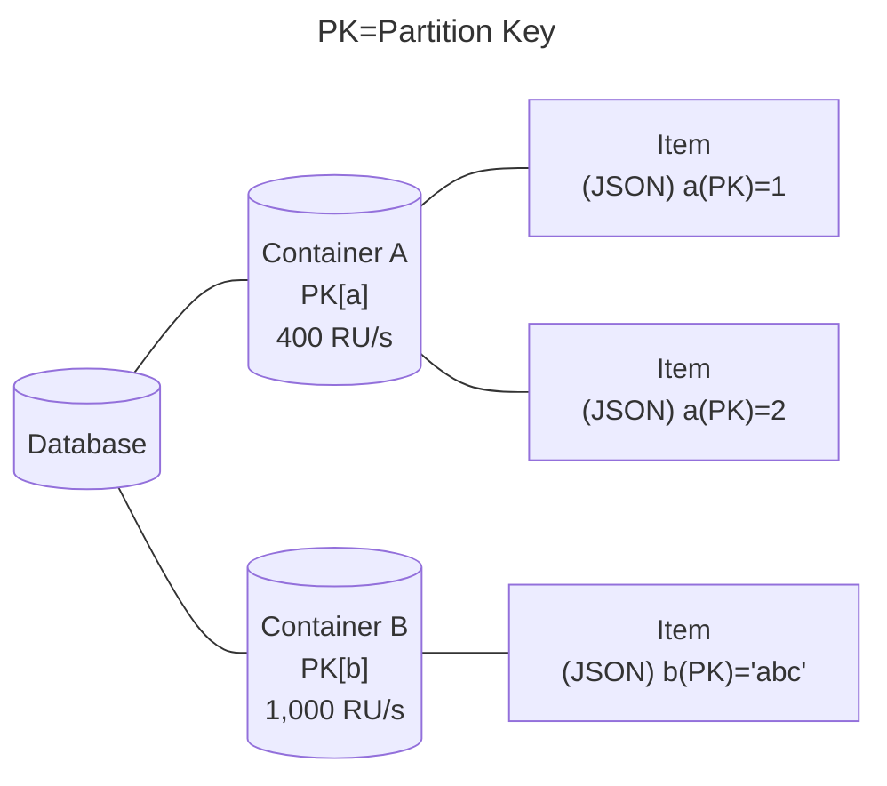
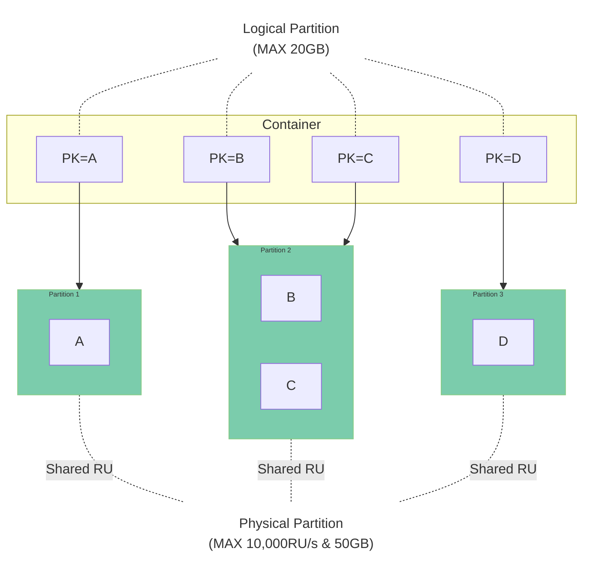
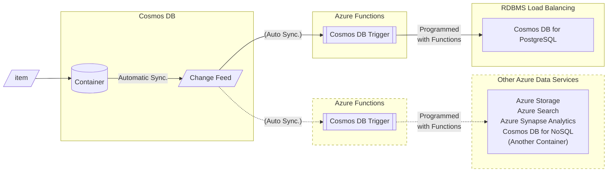
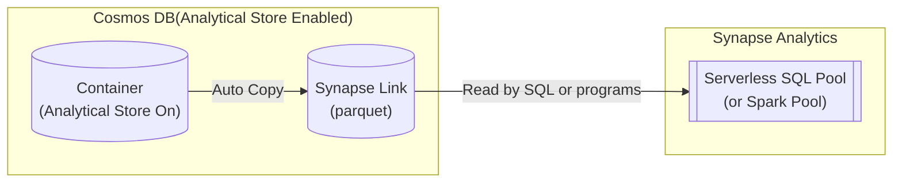
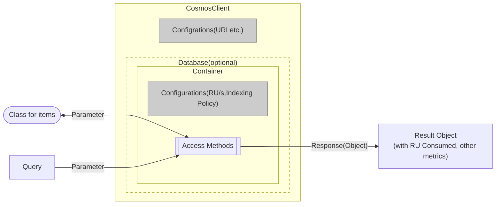

# Cosmos DB for NoSQL Overview

[Return to TOC](./readme.md)

## What is Cosmos DB for NoSQL?


- Cosmos DB is a **NoSQL datastore** available in Microsoft Azure
    - NoSQL is a different concept from a so-called **RDBMS**.
    - NoSQL has the best of both worlds: the simplicity of files and the speed of RDBMS searches.
    - NoSQL is a complementary, not exclusive, concept to RDBMS 

## Speriority of CosmosDB (Good)

### Flexible data structure based on **Document (JSON)**.
- JSON can handle **a flexible data structure** that does not require prior item definition (schema-less) in the following way.
```JSON
{
  "name"   : "John Smith",
  "sku"    : "20223",
  "price"  : 23.95,
  "shipTo" : { "name" : "Jane Smith",
               "address" : "123 Maple Street",
               "city" : "Pretendville",
               "state" : "NY",
               "zip"   : "12345" },
  "billTo" : { "name" : "John Smith",
               "address" : "123 Maple Street",
               "city" : "Pretendville",
               "state" : "NY",
               "zip"   : "12345" }
}
```

### SQL**-like** query language can be used to query data.
- SQL**-like** expressions are available.
```SQL
SELECT c.name, c.price FROM c
WHERE c.price > 10
```

*You can use SQL-like expressions in search query only. Creating item and updating are handled programmatically, not in SQL.

### High-speed processing with distributed architecture 
- Can **search** specific small amounts of data, from large amounts of data at **high speed (=low latency)**
- Data can be searched and extracted at high speed by combining data distribution by partitioning and searching by index.
- Latency will not increase if a large number of accesses, if they are properly distributed.

### Event-driven data processing can be built with **event activation** triggered by data registration.
- With an update queue called "Change Feed," in combination with Azure Functions, event-driven processing can be easily realized, such as "when one case is received, do something with it and send it to other services.

### Deployment in data centers worldwide as a preferred data service for Microsoft Azure
- Geo-distributed to ensure **high access speed** independent of access origin
- **Multi-master** for fast write speeds

### High flexibility on performance.
- **Flexibility to change** performance to match the workload changes. Automatic adjustment is also possible. (Note: some restrictions will be applied)

### Guaranteed Availability/Latency
- SLA guarantees **99.999% availability** [^1].
- For 1KB Read/Write, **99% response within 10ms**.

[^1]: SLA for multi-region read/write; 99.99% for single region

## Trade-off of Cosmos DB (Not so Good)

### Cosmos DB is not good at join processing.
- **Cosmos DB cannot join data across **different** containers (because they cross physical partitions).
- Schema-less feature can be used to merge different forms of data in the same container, but it is **highly expensive**.  

### Cosmos DB is not good at transactions to maintain consistency
- Transaction processing is possible, but the situation is limited and not suitable.

### Cosmos DB is not good at processing large amounts of data handled in a single operation.
- Processes such as merging and aggregation require a large amount of data to be read.  
  Cosmos DB tends to be expensive because it charges according to the amount of data to be processed.
- For aggregation and analysis, it is recommended to use another service other than Cosmos DB in combination.
  - Link data received from Cosmos DB to Spark/SQL/PowerBI etc. via Synapse Link.
  - Transfer and aggregate data each time by Change Feed
   
## What kind of system is Cosmos DB suitable for?

   - The **many** users and concurrent accesses are better
   - The **more** regions used, the better.
   - The **more** data that is stored, the better.
   - The **simpler** the query, the better
   - The size of data extracted per transaction should be **LESS**
   - Storing and using data for a **"HOT" period of time** is better
     - Long-term data storage and data analysis should be left to other mechanisms such as Blob Storage, Spark, RDMBS, etc.
     - A convenient mechanism (ChangeFeed/Synapse Link) is built in to transfer data to another mechanism.

## Typical use cases considering the above
   - Data management for web and mobile applications
     - Individual data viewing range is small and data handled in one process is small, but the more users, the more connections and total data volume
   - IoT device data processing
     - Individual device data volume is small, but the number of devices and locations is large in many cases
   - Product catalog
     - Information items to be managed differ by product type. Therefore, schema-less is a good match.
   - Log data management
     - Log data management Sometimes different forms of data are received from many services at the same time. 
   - Enterprise data relay
     - Takes on high write-load processing with multiple connections = **Place in front of ETL processing to RDMBS** There is a way to use it
     - Suitable for distributing received data to multiple services or extracting data with time lag

## The following services also use Cosmos DB
  - [Microsoft Teams](https://www.microsoft.com/ja-jp/microsoft-teams/group-chat-software)
  - [Open AI - ChatGPT](https://chat.openai.com/)
  - [Bengo4.com(Bengoshi=Lawyers) - AI Legal Counseling](https://chat.bengo4.com/)

## Benefits for Developers
   - Application response time is constant regardless of the number of accesses or the amount of data
     - If you design an application and data model suitable for distributed processing, parallel processing can be performed correctly even when data increases.
     - No need to worry about the number of accesses and the number of data as your business grows.
   - Contributes to efficiency of agile system development and modification
      - Benefits of Schema-less
          - No need to modify past data even if database items are changed
          - Allows for changes in the data model during agile development

# How Cosmos DB works

## What is Throughput (Request Unit: RU)?

Throughput specifies the **read/write performance** of an item to a container.

The unit is **RU (Request Unit)**, where 1RU = **1KB of resources** consumed in processing a read.

The processing performance of Cosmos DB for NoSQL is calculated entirely in terms of these RUs. This includes the following internal processes
- Locking for writes
- Writes, reads, and searches for indexes
- Reads that did not hit the filter criteria in the data search

Reads The table below shows the approximate RU consumed by each operation based on 1KB=1RU.

|Operation|Consumption RU (approximate)|
|---|---:|
|Update|2~3|
|Write|5~6|
|Query|5~10+|

This is because changes and writes require **costly** internal processing, such as index reading and data checking before changes are made.  
Also, if the index was not available in the query, the RU consumption will be higher if there is a lot of data scanned up to that point, even if the data filtered by the WHERE clause was small.

### Types of Throughput

Cosmos DB for NoSQL uses the following two settings to define performance.

#### Provisioning Throughput
- The throughput is defined in advance in units of 100 RU/s, and the performance is secured (provisioned).
The billing unit is 100 RU/s. Requests exceeding the allocated performance will be rejected as an over-request (**429**) error.
- There are two ways to ensure throughput: "standard" and "auto scale".
    - Standard throughput
        - The same RU/s is always ensured.
    - Automatic (auto scale) throughput
        - Ensure maximum available RU/s, and reduce RU/s to minimum 1/10 when idle.

#### Serverless
- Ensure throughput only when used.
    - Suitable when it is difficult to estimate throughput in advance  
- However, there are the following limitations
  - Maximum throughput is **20,000 RU/s**.
  - Maximum amount of storage is limited to **1TB**.
- As the number of physical partitions (discussed below) increases, the amount of RU/s allocated to each physical partition will drop.
  - The number of physical partitions increases** as the data volume exceeds **50GB**,  
    20,000 RU/s will be **equally distributed** by the number of partitions (5,000 RU/s per partition maximum)
  - Performance may be degraded by rapid data growth, processing concentration, etc. when RU/s allocation is reduced
  
## Database, Container, Items



### Item
The basic unit of storing. JSON documents are stored as items.

The items of the JSON document can be freely defined, but must include the **partition key values** defined in the container.

Cosmos DB for NoSQL has a size limit of **up to 2MB** per item.

Each JSON document automatically has some system properties in addition to the items properties by the user.

|System property name|Purpose|
|---|---|
|_rid|unique identifier of the item|
|_etag|Entity tag used for optimistic concurrency control|
|_ts|Timestamp of the last update of the item (UNIX time)|
|_self|Addressable URI of the item|

### Partition key

Key property that determines where items are stored.  
It must be specified at the time of container creation and cannot be changed after container creation.

To take advantage of Cosmos DB scale-out, it is desirable to set an item that satisfies the following conditions as a partition key. 

1. the value should be varied appropriately.
   - (Since this is the standard for distribution when storing data, it cannot be distributed if it is not varied. 
   - The number of uniques should be at least (total data volume ÷ 5~10GB). 
1. The value set in the partition key should always have the possibility of being used by the system accessing it.
   - The value set in the partition key should not be an item that will eventually be accessed less frequently, such as a timestamp.

Partition key entries can have hierarchies.
Up to 3 hierarchies can be specified. This streamlines searches of only the top level hierarchy.  

Example) If you have a hierarchical partition key with three levels of [Tenant Id] - [User Id] - [Session ID]:

|Where clause contains an item|action|
|-----|-----|
|[Tenant Id][User Id][Session Id]|complete index search|
|[Tenant Id][User Id]|partial index search|
|[Tenant Id]|partial index search|
|[User Id][Session Id]|Index search disabled|
|[Session Id]|Index search disabled|


### Container

An object where items are stored.  
Since it has no schema, items with different properties can be stored at the same time.

Can set throughput for each container.  

A partition key is set when the container is created. Items are distributed and stored in logical partitions based on this partition key.  

If Time to Live (TTL) is set for a container, items are automatically deleted after a specified number of seconds.  
After setting the TTL for a container, you can override the TTL for individual items with the item item item "ttl".

Containers can contain stored procedures, triggers, and user-defined functions.

### Database.

A group of containers.  
Up to 25 containers per database can share throughput when using shared throughput.

## Partitions

<!--

-->



<!---
```mermaid
graph LR
  subgraph "Physical Partition 2: MAX10,000RU/s, 50GB"
    subgraph "Logical Partition C : MAX 20GB"
      "Item C1"
    end
    subgraph "Logical Partition D : MAX 20GB"
      "Item D1"
      "Item D2"
    end
  end
  subgraph "Physical Partition1: MAX10,000RU/s, 50GB"
    subgraph "Logical Partition A : MAX 20GB"
      "Item A1"
      "Item A2"
    end
    subgraph "Logical Partition B : MAX 20GB"
      "Item B1"
      "Item B2"
      "Item B3"
    end
  end
```
-->

The unit of measure for storing items per container.
**Needs attention in design because it is a key concept** that determines the method of distributed access.

### logical partition

Items stored in containers are placed in compartments called **logical partitions** based on the hash value range of the partition key.  
A logical partition can contain up to 20GB of items and indexes with the same partition key.  
**The size of a single logical partition cannot be larger than 20GB. ** [^2].

[^2]: Temporary increase can be allowed with Service Request (SR), but it will not be subject to SLA.

### physical partition

Logical partitions are placed on a single **physical partition**.
A physical partition is a unit of **distributed processing** with a maximum processing capacity of 10,000 RU/s and a maximum storage of 50GB.
Data operations are performed based on the processing capacity of this **physical partition** (assigned RU/s).

As the configured throughput or stored data size exceeds the upper limit of the physical partition  
The number of physical partitions **automatically increases, but does not automatically decrease** [^3].

> When increasing the throughput of an existing container, the number of physical partitions will increase for every 10,000 RU/s.
> If you set a throughput of more than 6,000 RU/s for a new container, `set RU/s ÷ 6,000` physical partitions will be created.

The set throughput will be **equally distributed** among the existing physical partitions [^4].

Example : If a container used at 5,000RU/s is changed to 12,000RU/s, it will be distributed to two physical partitions. Each physical partition is equally allocated 6,000 RU/s of throughput.  
If the container throughput is subsequently changed back to 5,000 RU/s, it will still be distributed across the two physical partitions. In that case, each physical partition will be allocated equally, i.e., 2,500 RU/s of throughput.

Since the user basically has no control over the physical partitions [^3], the application/data model design should focus on **logical partitions (= partition key settings) and access methods (= WHERE clause in queries)**.
  
Specifically, it is desirable to **"make the item corresponding to the WHERE clause of a query that occurs many times at the same time a preferred candidate for a partition key.  
This is because **if the item specified in the WHERE clause and the partition key are identical, **a search of only a single physical partition can return results at low cost**.  
Conversely, if a search is performed on an item other than **the partition key**, the cost is necessarily higher because the result cannot be returned without at least **checking all physical partitions**.

[^3]: The ability to merge physical partitions is in preview.  
[^4]: The ability to increase the RU allocation to a specific physical partition is currently in preview.

## Index, index policy

An index is an **index** that indicates the location of an item.  

**Searching for indexed items can be fast. **  
Conversely, searches on non-indexed items require a full scan of the data, which is very inefficient according to the Cosmos DB specification.

All items registered in a container are indexed by **default**.  
Indexes use Cosmos DB storage. It also consumes RUs for write and read operations.   

Indexes are generated according to the **indexing policy** specified in the container in JSON format.  
Therefore, index creation in Cosmos DB can be controlled by overriding the index creation policy as necessary.

Typical controls by the index creation policy are shown below.

- Control the index creation mode
- Specify items to generate or not to generate indexes
- Create spatial and composite indexes

Indexing policies can be changed at any time using the Portal or SDK, but the actual indexing changes are performed on the back end, consuming RU.  
Progress can be tracked in the Portal or SDK.

## Change Feed


An ordered record of information on items that have been registered or changed in a Cosmos DB container is called a Change Feed.

There are two ways to access Change Feed.

|Access Method|Description|
|----|----|
|Push Model|Azure Functions' Cosmos DB Trigger is used to launch the program.|
|Pull Model|Programs periodically access Change Feed to retrieve data|

Push model of launching programs using the Cosmos DB Trigger in Azure Functions is more convenient.  
This method will be used in this hands-on.

Change Feed (LatestVersion mode) cannot take information on deletion.  
Also, it is not possible to take the progress in the middle of a change. [^5]  

[^5]: Currently there is a "delete mode with all versions" in preview, which can take information on deletions.

## Synapse Link


Due to the specifications of Cosmos DB, it is not good to aggregate or analyze items registered in Cosmos DB containers directly.  
Therefore, Synapse Link is a function that allows data to be stored separately in a form suitable for aggregation and analysis, and to be accessed by Synapse Analytics. This is strong in analysis and aggregation.

When the Analytical Store is enabled in your Cosmos DB account, the items registered in the container is automatically copied to Synapse Link.  
The items copied to Synapse Link is stored in parquet format, which is a column store type of data, and it is suitable for aggregation and analysis.

The parquet data in Synapse Link can be directly accessed from the Serverless SQL Pool and Spark Pool in Synapse Analytics.  
This access does not consume Cosmos DB RUs. (Synapse Analytics usage fees apply).

## SDK

### Available in various languages

Cosmos DB provides SDKs for the following languages

- .NET(C#)
- Java
- Node.js
- Python
- Go

> SDKs for C# and Java are more likely to reflect the latest functionality.

### Development with Cosmos DB SDK



1. Create Client(CosmosClient)
1. Create Database Object
1. Create Container Object
1. Create Item Class(C#)
1. Item Operations
    1. Create, Update Delete Items
        1. Call Access Method for each operation with id and Partition Key.
    2. Get Items
        1. Call Access Method for each operation with id and Partition Key.
        1. Call Access Method for each operation with Query.
2. Get Metricies
    1. Get the Error Codes, RU Consumption included in Result Object, that is responded from the Access method.


