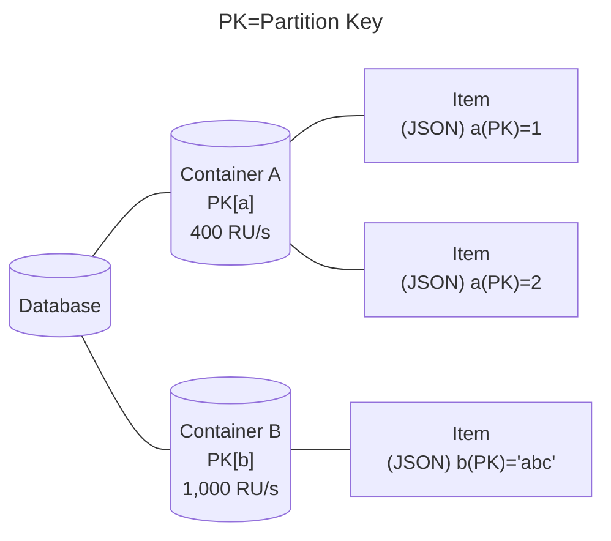
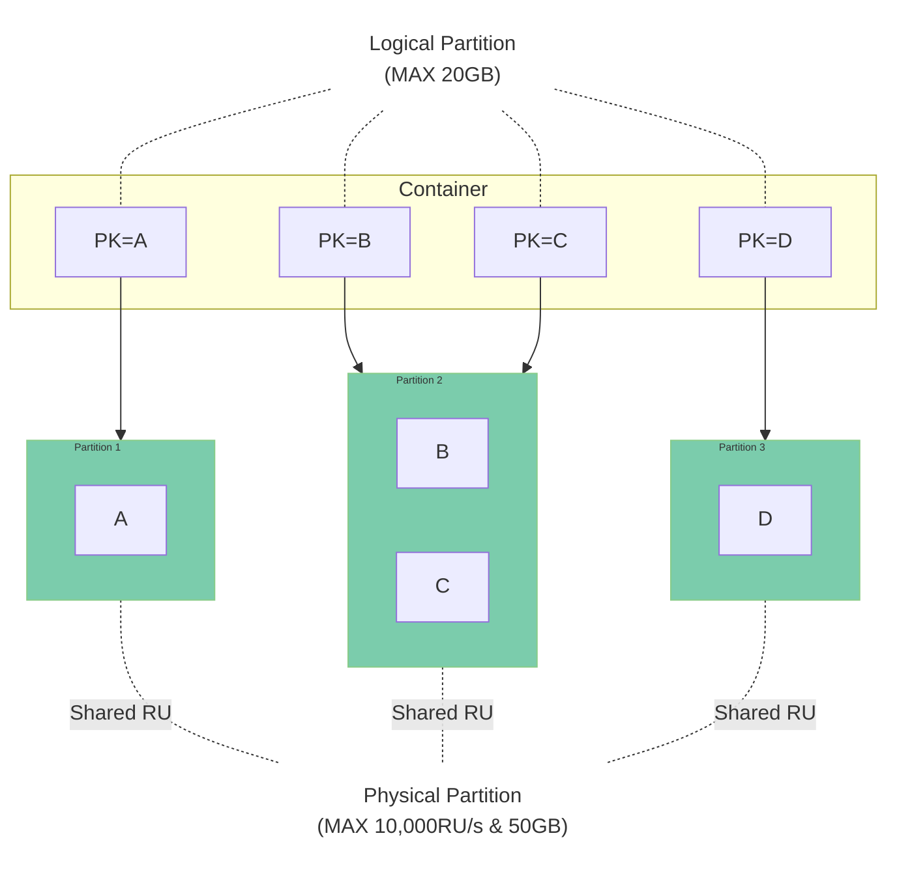
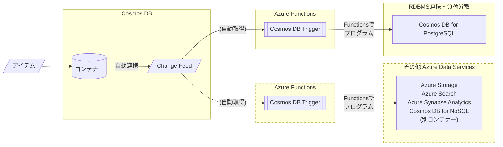
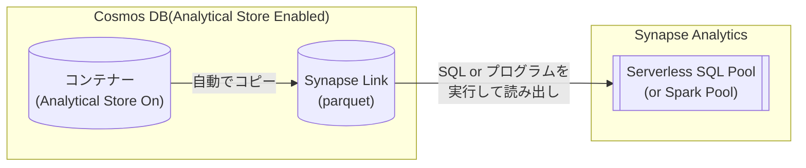
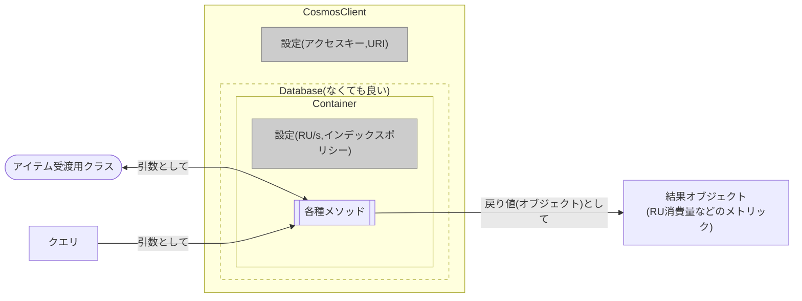

# Cosmos DB for NoSQL Overview

[Return to TOC](./readme.md)

## What is Cosmos DB for NoSQL?


- Cosmos DB is a **NoSQL datastore** available in Microsoft Azure
    - NoSQL is a different concept from a so-called **RDBMS**.
    - NoSQL has the best of both worlds: the simplicity of files and the speed of RDBMS searches.
    - NoSQL is a complementary, not exclusive, concept to RDBMS 

## Speriority of CosmosDB (Good)

### Flexible data structure based on **Document (JSON)**.
- JSON can handle **a flexible data structure** that does not require prior item definition (schema-less) in the following way.
```JSON
{
  "name"   : "John Smith",
  "sku"    : "20223",
  "price"  : 23.95,
  "shipTo" : { "name" : "Jane Smith",
               "address" : "123 Maple Street",
               "city" : "Pretendville",
               "state" : "NY",
               "zip"   : "12345" },
  "billTo" : { "name" : "John Smith",
               "address" : "123 Maple Street",
               "city" : "Pretendville",
               "state" : "NY",
               "zip"   : "12345" }
}
```

### SQL**-like** query language can be used to query data.
- SQL**-like** expressions are available.
```SQL
SELECT c.name, c.price FROM c
WHERE c.price > 10
```

*You can use SQL-like expressions in search query only. Creating item and updating are handled programmatically, not in SQL.

### High-speed processing with distributed architecture 
- Can **search** specific small amounts of data, from large amounts of data at **high speed (=low latency)**
- Data can be searched and extracted at high speed by combining data distribution by partitioning and searching by index.
- Latency will not increase if a large number of accesses, if they are properly distributed.

### Event-driven data processing can be built with **event activation** triggered by data registration.
- With an update queue called "Change Feed," in combination with Azure Functions, event-driven processing can be easily realized, such as "when one case is received, do something with it and send it to other services.

### Deployment in data centers worldwide as a preferred data service for Microsoft Azure
- Geo-distributed to ensure **high access speed** independent of access origin
- **Multi-master** for fast write speeds

### High flexibility on performance.
- **Flexibility to change** performance to match the workload changes. Automatic adjustment is also possible. (Note: some restrictions will be applied)

### Guaranteed Availability/Latency
- SLA guarantees **99.999% availability** [^1].
- For 1KB Read/Write, **99% response within 10ms**.

[^1]: SLA for multi-region read/write; 99.99% for single region

## Trade-off of Cosmos DB (Not so Good)

### Cosmos DB is not good at join processing.
- **Cosmos DB cannot join data across **different** containers (because they cross physical partitions).
- Schema-less feature can be used to merge different forms of data in the same container, but it is **highly expensive**.  

### Cosmos DB is not good at transactions to maintain consistency
- Transaction processing is possible, but the situation is limited and not suitable.

### Cosmos DB is not good at processing large amounts of data handled in a single operation.
- Processes such as merging and aggregation require a large amount of data to be read.  
  Cosmos DB tends to be expensive because it charges according to the amount of data to be processed.
- For aggregation and analysis, it is recommended to use another service other than Cosmos DB in combination.
  - Link data received from Cosmos DB to Spark/SQL/PowerBI etc. via Synapse Link.
  - Transfer and aggregate data each time by Change Feed
   
## What kind of system is Cosmos DB suitable for?

   - The **many** users and concurrent accesses are better
   - The **more** regions used, the better.
   - The **more** data that is stored, the better.
   - The **simpler** the query, the better
   - The size of data extracted per transaction should be **LESS**
   - Storing and using data for a **"HOT" period of time** is better
     - Long-term data storage and data analysis should be left to other mechanisms such as Blob Storage, Spark, RDMBS, etc.
     - A convenient mechanism (ChangeFeed/Synapse Link) is built in to transfer data to another mechanism.

## Typical use cases considering the above
   - Data management for web and mobile applications
     - Individual data viewing range is small and data handled in one process is small, but the more users, the more connections and total data volume
   - IoT device data processing
     - Individual device data volume is small, but the number of devices and locations is large in many cases
   - Product catalog
     - Information items to be managed differ by product type. Therefore, schema-less is a good match.
   - Log data management
     - Log data management Sometimes different forms of data are received from many services at the same time. 
   - Enterprise data relay
     - Takes on high write-load processing with multiple connections = **Place in front of ETL processing to RDMBS** There is a way to use it
     - Suitable for distributing received data to multiple services or extracting data with time lag

## The following services also use Cosmos DB
  - [Microsoft Teams](https://www.microsoft.com/ja-jp/microsoft-teams/group-chat-software)
  - [Open AI - ChatGPT](https://chat.openai.com/)
  - [Bengo4.com(Bengoshi=Lawyers) - AI Legal Counseling](https://chat.bengo4.com/)

## Benefits for Developers
   - Application response time is constant regardless of the number of accesses or the amount of data
     - If you design an application and data model suitable for distributed processing, parallel processing can be performed correctly even when data increases.
     - No need to worry about the number of accesses and the number of data as your business grows.
   - Contributes to efficiency of agile system development and modification
      - Benefits of Schema-less
          - No need to modify past data even if database items are changed
          - Allows for changes in the data model during agile development

# How Cosmos DB works

## What is Throughput (Request Unit: RU)?

Throughput specifies the **read/write performance** of an item to a container.

The unit is **RU (Request Unit)**, where 1RU = **1KB of resources** consumed in processing a read.

The processing performance of Cosmos DB for NoSQL is calculated entirely in terms of these RUs. This includes the following internal processes
- Locking for writes
- Writes, reads, and searches for indexes
- Reads that did not hit the filter criteria in the data search

Reads The table below shows the approximate RU consumed by each operation based on 1KB=1RU.

|Operation|Consumption RU (approximate)|
|---|---:|
|Update|2~3|
|Write|5~6|
|Query|5~10+|

This is because changes and writes require **costly** internal processing, such as index reading and data checking before changes are made.  
Also, if the index was not available in the query, the RU consumption will be higher if there is a lot of data scanned up to that point, even if the data filtered by the WHERE clause was small.

### Types of Throughput

Cosmos DB for NoSQL uses the following two settings to define performance.

#### Provisioning Throughput
- The throughput is defined in advance in units of 100 RU/s, and the performance is secured (provisioned).
The billing unit is 100 RU/s. Requests exceeding the allocated performance will be rejected as an over-request (**429**) error.
- There are two ways to ensure throughput: "standard" and "auto scale".
    - Standard throughput
        - The same RU/s is always ensured.
    - Automatic (auto scale) throughput
        - Ensure maximum available RU/s, and reduce RU/s to minimum 1/10 when idle.

#### Serverless
- Ensure throughput only when used.
    - Suitable when it is difficult to estimate throughput in advance  
- However, there are the following limitations
  - Maximum throughput is **20,000 RU/s**.
  - Maximum amount of storage is limited to **1TB**.
- As the number of physical partitions (discussed below) increases, the amount of RU/s allocated to each physical partition will drop.
  - The number of physical partitions increases** as the data volume exceeds **50GB**,  
    20,000 RU/s will be **equally distributed** by the number of partitions (5,000 RU/s per partition maximum)
  - Performance may be degraded by rapid data growth, processing concentration, etc. when RU/s allocation is reduced
  
## Database, Container, Items



### Item
The basic unit of storing. JSON documents are stored as items.

The items of the JSON document can be freely defined, but must include the **partition key values** defined in the container.

Cosmos DB for NoSQL has a size limit of **up to 2MB** per item.

Each JSON document automatically has some system properties in addition to the items properties by the user.

|System property name|Purpose|
|---|---|
|_rid|unique identifier of the item|
|_etag|Entity tag used for optimistic concurrency control|
|_ts|Timestamp of the last update of the item (UNIX time)|
|_self|Addressable URI of the item|

### Partition key

Key property that determines where items are stored.  
It must be specified at the time of container creation and cannot be changed after container creation.

To take advantage of Cosmos DB scale-out, it is desirable to set an item that satisfies the following conditions as a partition key. 

1. the value should be varied appropriately.
   - (Since this is the standard for distribution when storing data, it cannot be distributed if it is not varied. 
   - The number of uniques should be at least (total data volume ÷ 5~10GB). 
1. The value set in the partition key should always have the possibility of being used by the system accessing it.
   - The value set in the partition key should not be an item that will eventually be accessed less frequently, such as a timestamp.

Partition key entries can have hierarchies.
Up to 3 hierarchies can be specified. This streamlines searches of only the top level hierarchy.  

Example) If you have a hierarchical partition key with three levels of [Tenant Id] - [User Id] - [Session ID]:

|Where clause contains an item|action|
|-----|-----|
|[Tenant Id][User Id][Session Id]|complete index search|
|[Tenant Id][User Id]|partial index search|
|[Tenant Id]|partial index search|
|[User Id][Session Id]|Index search disabled|
|[Session Id]|Index search disabled|


### Container

An object where items are stored.  
Since it has no schema, items with different properties can be stored at the same time.

Can set throughput for each container.  

A partition key is set when the container is created. Items are distributed and stored in logical partitions based on this partition key.  

If Time to Live (TTL) is set for a container, items are automatically deleted after a specified number of seconds.  
After setting the TTL for a container, you can override the TTL for individual items with the item item item "ttl".

Containers can contain stored procedures, triggers, and user-defined functions.

### Database.

A group of containers.  
Up to 25 containers per database can share throughput when using shared throughput.

## Partitions

<!--

-->



<!---
```mermaid
graph LR
  subgraph "Physical Partition 2: MAX10,000RU/s, 50GB"
    subgraph "Logical Partition C : MAX 20GB"
      "Item C1"
    end
    subgraph "Logical Partition D : MAX 20GB"
      "Item D1"
      "Item D2"
    end
  end
  subgraph "Physical Partition1: MAX10,000RU/s, 50GB"
    subgraph "Logical Partition A : MAX 20GB"
      "Item A1"
      "Item A2"
    end
    subgraph "Logical Partition B : MAX 20GB"
      "Item B1"
      "Item B2"
      "Item B3"
    end
  end
```
-->

コンテナーごとにアイテムを格納する単位。
**分散アクセスの方法を決定する**キーとなる概念のため、設計上注意が必要。

### 論理パーティション

コンテナーに格納されるアイテムは、パーティションキーのハッシュ値範囲をもとに**論理パーティション**という区画に配置される。  
論理パーティションは同一のパーティションキーを持つアイテムとインデックスを20GBまで格納できる。  
**一つの論理パーティションのサイズが20GB以上になることはできない。** [^2]

[^2]: サービスリクエスト(SR)で一時的に増加を許容することができるが、SLA対象ではなくなる。

### 物理パーティション

論理パーティションは単一の**物理パーティション**に配置される。
物理パーティションは、**最大10,000RU/sの処理能力と最大50GBのストレージをもつ分散処理の単位**である。
この**物理パーティションの処理能力(付与されたRU/s)を基準として**データ操作が行われる。

設定されたスループットや格納されたデータサイズが物理パーティションの上限を超えることにより  
物理パーティションの数は**自動的に増加するが、自動的に減少することはない** [^3]。

> 既存のコンテナーのスループットを増加させる場合、10,000RU/sごとに物理パーティション数が増える。
> 新規のコンテナーに6,000RU/s以上のスループットを設定すると、`設定したRU/s ÷ 6,000`個の物理パーティションが作成される。

設定されたスループットは存在する物理パーティション間で**均等に分配**される [^4]。

例 : 5,000RU/sで利用しているコンテナーを、12,000RU/sに変更した場合、2つの物理パーティションに分散される。各物理パーティションは均等に6,000RU/sのスループットが割り当てられる。  
その後コンテナーのスループットを5,000RU/sに戻した場合でも、2つの物理パーティションに分散されたままとなる。その場合、物理パーティションごとに均等、つまり2,500RU/sのスループットが割り当てられる。

物理パーティションを利用者が制御することは基本的にできない[^3]ため、アプリ/データモデル設計においては**論理パーティション(=パーティションキー設定)とアクセス方式(=クエリのWHERE句)に重点を置くべき**である。
  
具体的には **「同時に多数発生するクエリのWHERE句に相当する項目をパーティションキーの優先的な候補とする」** ことが望ましい。  
これは、WHERE句に指定された項目とパーティションキーが同一であれば、**単一の物理パーティションのみの検索で低コストに結果を返す**ことができるからである。  
逆に、**パーティションキー以外の項目で検索がされた場合**は、少なくとも **すべての物理パーティションを確認**しないと結果が返せないため、必然的にコストは高くなる。

[^3]: 物理パーティションをマージする機能がプレビュー中。  
[^4]: 特定の物理パーティションへのRU割り当てを増加させることができる機能が現在プレビュー中。

## インデックス、インデックスポリシー

インデックスは**アイテムの位置を示す索引**である。  

**インデックスがある項目に対する検索は高速に行うことができる。**  
逆にいえばインデックスがない項目に対する検索はデータを全件スキャンする必要があり、Cosmos DBの仕様からすると非常に非効率な動作となる。

コンテナーに登録されるアイテムには**既定ですべての項目に対してインデックスが生成**される。  
インデックスはCosmos DBのストレージを使用する。また、書き込み・読み出しについてはRUを消費する。   

インデックスは、コンテナーにJSON書式で規定された **インデックス作成ポリシー** にしたがって生成される。  
よって、必要に応じてインデックス作成ポリシーを上書きして、Cosmos DBにおけるインデックス生成を制御することができる。

インデックス作成ポリシーによる代表的な制御を以下に示す。

- インデックス作成モードを制御する
- インデックスを生成する・しない項目を特定する
- 空間インデックス・複合インデックスを作成する

インデックス作成ポリシーはポータルやSDKを用いていつでも変更可能であるが、実際のインデックスの変更はバックエンドでRUを消費しながら実行される。  
進行状況についてはポータル、もしくはSDKで追跡ができる。

## Change Feed


Cosmos DBのコンテナーに登録・変更されたアイテムの情報の順序だてた記録をChange Feedと呼ぶ。

Change Feedにアクセスする方法として以下2つがある。

|アクセス方式|説明|
|----|----|
|プッシュモデル|Azure FunctionsのCosmos DB Triggerを使用してプログラムを起動する|
|プルモデル|プログラムから定期的にChange Feedにアクセスしてデータを取得する|

主として、Azure FunctionsのCosmos DB Triggerを使用してプログラムを起動するプッシュモデルの利便性が高い。  
本ハンズオンではこの方法を使用する。

Change Feed(LatestVersionモード)では削除の情報を取ることができない。  
また、変更に関しても途中の経過を取ることができない。[^5]  

[^5]: 現在、削除の情報を取ることができる、"すべてのバージョンと削除 モード"がプレビュー中である。

## Synapse Link


Cosmos DBのコンテナーに登録されている情報を直接集計や分析にかけるのはCosmos DBの仕様上、好ましくない。  
そのため、集計や分析に掛けるためにデータを集計・分析に適した形で別に保管し、分析・集計に強いSynapse Analyticsからアクセスできるようにする機能がSynapse Linkである。

Cosmos DBのアカウントでAnalytical Storeを有効にすると、コンテナーに登録された情報を自動的にSynapse Linkにコピーする。  
Synapse Linkにコピーされたデータはparquet形式で保管される。parquet形式は列ストア型のデータであり、集計や分析に適した形式である。

Synapse Linkのparquet形式のデータは、Synapse AnalyticsのServerless SQL PoolやSpark Poolから直接参照することができる。  
このアクセスの際、Cosmos DBのRUを消費しない。(Synapse Analyticsの利用料金はかかる)

## SDK

### 各言語での対応

Cosmos DBは以下の言語のSDKを提供している。

- .NET(C#)
- Java
- Node.js
- Python
- Go

> C#,JavaのSDKは最新の機能が反映されやすい。

### Cosmos DB SDKでの開発



1. Client(CosmosClient)の生成
1. Databaseオブジェクトの生成
1. Containerオブジェクトの生成
1. アイテム受信用のクラスの作成(C#)
1. アイテム操作
    1. アイテム作成・更新・削除
        1. idやパーティションキーを指定して該当メソッドを呼び出す
    2. アイテムの取得
        1. idやパーティションキーを指定して該当メソッドを呼び出す
        1. SQL(ライク)なクエリを指定して該当メソッドを呼び出す
2. メトリックなどの取得
    1. 操作メソッドの結果オブジェクトに含まれるエラーコードやRU消費量などを取得する

<!--
## その他 

### 整合性レベル

### バックアップ
-->

