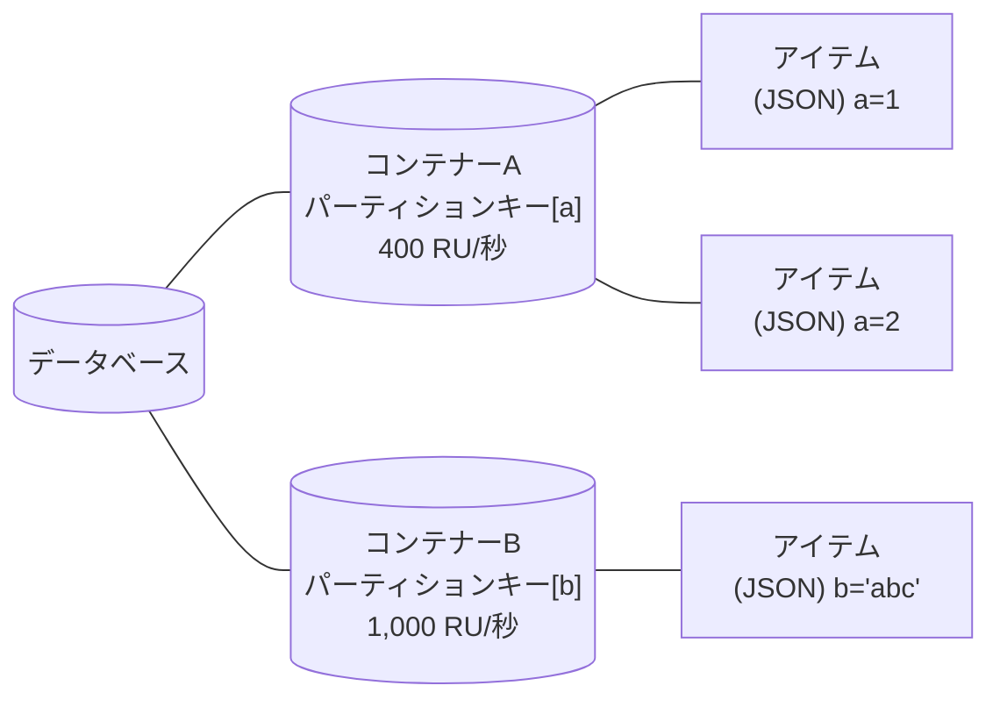
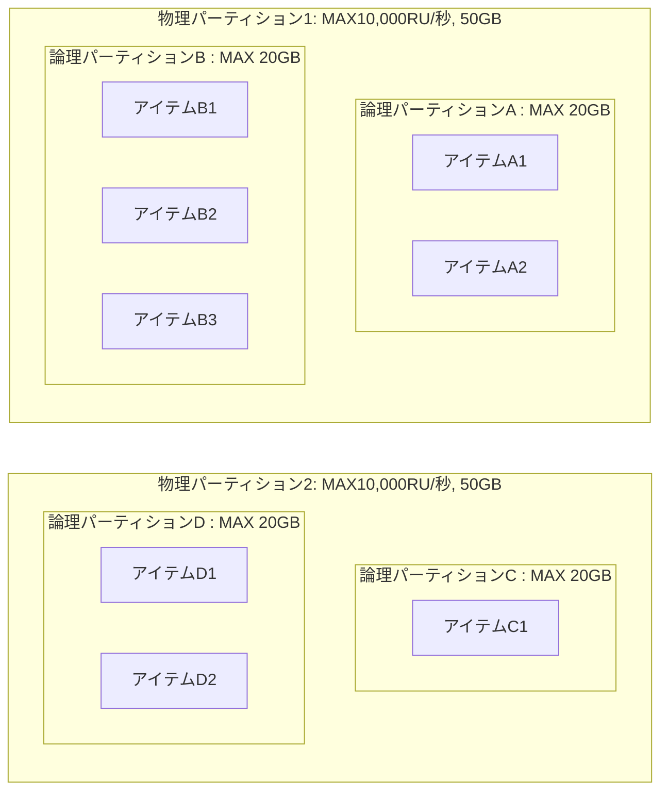
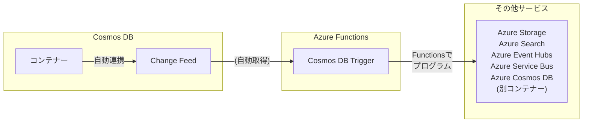
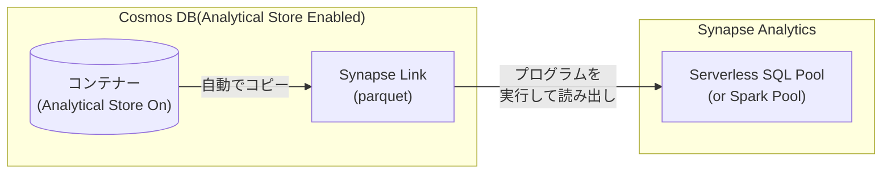

# Cosmos DB (NoSQL) 概要 & Hands On

> 本ページはCosmos DB for **NoSQL**の概要について説明する。<br>
その他のCosmos DB APIについての説明は[こちら](https://learn.microsoft.com/ja-jp/azure/cosmos-db/https://)を参照のこと

# 目次

1. Cosmos DB NoSQL 概要 (1hour)
1. [Cosmos DB NoSQLの操作](./CreateAndOperationBasic_CosmosDB.md) (30min)
1. Cosmos DB Change Feed 概要 (30min)
1. Cosmos DB Change Feedの操作 (1hour)
    1. Azure Functionsの作成
    1. Azure Functionsのコーディング

# Cosmos DB for NoSQL 概要

## Cosmos DB for NoSQLとは？


- Microsoft Azureで利用できる**NoSQLデータストア**
    - いわゆる **データベース(RDBMS)** とは異なる概念と理解するのが良い
    - ファイルの簡便性とRDBMSの高速検索の良いとこどり
    - RDBMSを補完する概念であり、排他的ではない 

### 優位性
  - **ドキュメント(JSON)** を基準とする柔軟なデータ構造
    - JSONは以下のような形でスキーマレスであり、事前の項目定義が必要ない柔軟なデータ構造を扱える。
    ```JSON
    {
      "name"   : "John Smith",
      "sku"    : "20223",
      "price"  : 23.95,
      "shipTo" : { "name" : "Jane Smith",
                   "address" : "123 Maple Street",
                   "city" : "Pretendville",
                   "state" : "NY",
                   "zip"   : "12345" },
      "billTo" : { "name" : "John Smith",
                   "address" : "123 Maple Street",
                   "city" : "Pretendville",
                   "state" : "NY",
                   "zip"   : "12345" }
    }
    ```

  - データのクエリにSQLライクなクエリ言語を利用できる。
    - SQLライクな表現を利用できるのは検索時のみで、データ登録・更新には利用できない。
    ```SQL
    SELECT c.name, c.price
    FROM c
    WHERE c.price > 10
    ```
  - 大量データの中から特定の少量データを**高速に検索**できる
    - パーティションによるデータ分散と、インデックスによる検索を組み合わせてデータを高速に検索・抽出できる。
  - 同時アクセスなどによる**高負荷時でも処理を分散**してレイテンシーを落とさない
    - 多数のアクセスが適切に分散されていればレイテンシーが増えることはない。
  - データ登録を起点とする**イベント起動**ができイベント駆動型データ処理を実現
    - Change Feedという更新キューを持つ。Azure Functionsとの組み合わせで、「1件受信したら何か処理をして他のサービスへ配信する」ようなイベント駆動型処理を簡単に実現することができる。
  - 地理分散を利用して**アクセス元の地域に寄らない高速なアクセス速度**を保証
  - **マルチマスター**による高速な書き込み
  - **負荷に合わせて性能を自由に変更**できる。自動調整も可能。(注:制約はある)
  - SLAで**99.999%の可用性**を保証 [^1]
  - 1KB Read/Writeに関しては**99%の処理を10ms以内で応答**

    [^1]: 複数リージョン読み込み・書き込み時のSLA。単一リージョンの場合は99.99%

### トレードオフ
  - コレクション間の結合処理
    - **異なる**コレクションをまたいでデータを結合することはできない(物理パーティションをまたぐため)
    - スキーマレスの特長を生かして、異なる形のデータを同じコレクションに入れて結合することはできるが **高コスト**
  - トランザクション処理
      - 利用できるが、状況が限定的であり向いていない
  - 1度の操作で扱うデータ量が多い処理
    - 結合、集計などの処理は大量のデータ読み込みが発生する。  
      Cosmos DBは操作対象となるデータ量に応じて課金が発生するため、高コストになりがち
    - 集計・分析用途のためには別の仕組みを利用することが推奨される
      - Spark/SQL連携のSynapse Link
      - Change Feedによるデータの都度転送、都度集計
   
### 何が向いている、向いていない？

   - 利用者や同時アクセス数は**多い**方が良い
   - 利用される地域は**多い**ほど良い
   - 蓄積されるデータは**多い**方が良い
   - クエリは**シンプル**なほうが良い
   - 処理1回にて抽出されるデータサイズは**少ない**方が良い
   - データが **"HOT"な期間、蓄積して利用する** のが良い
     - 長期的なデータ保存やデータ分析はBlob Storage、Spark、RDMBSなど別の仕組みに任せるほうがよい
     - 別の仕組みにデータを移すための便利な仕組み(ChangeFeed/Synapse Link)が組み込まれている

### 上記を考慮した典型的なユースケース
   - Webアプリ・モバイルアプリのデータ管理
     - 個人のデータ閲覧範囲は狭く、1度の処理で扱うデータは小さいが、ユーザーが多くなれば接続数・総データ量も多くなる
   - IoTデバイスデータ処理
     - デバイス個々のデータ量は少ないが、デバイス数や拠点が多くなるケースが多い
   - プロダクトカタログ
     - 製品種別ごとに管理する情報が異なる。そのためスキーマレスと相性がいい
   - ログデータ管理
     - 同時に多くのサービスから異なる形のデータを受け取ることがある 
   - エンタープライズデータ中継
     - 受け取ったデータを複数のサービスに分配したり、時間差で抽出したりする場合に向いている

### 以下のサービスでもCosmosDBが利用されている
  - Microsoft Teams
  - Open AI - ChatGPT
  - [弁護士ドットコム - AI法律相談](https://chat.bengo4.com/)

### 開発者向けのメリット
   - アプリケーションの応答速度がアクセス数やデータ量に寄らず一定になる
     - NoSQLに合ったアプリ設計を合わせて行う必要がある
     - ビジネスの拡大に伴うアクセス数・データ数の増加を気にせず運用できる
   - システム変更の効率化に寄与
      - データベース項目の変更があってもスキーマレスのため過去データを直さなくてよい

# Cosmos DBの仕組み

## スループット(Request Unit:RU)

スループットは**コンテナーに対するアイテムの読み書き性能**を規定する。

単位は **RU(Request Unit)** で、1RU = 1KBの読み込みにかかる処理で消費されるリソースを指す。

CosmosDB for NoSQLの処理性能は、すべてこのRUで計算される。これは、以下の内部処理を含む。
- 書き込みのためのロック
- インデックスの書き込み、読み出し、検索
- データ検索でフィルター条件にヒットしなかった読み込み

そのため、基本的には読み込み 1KB=1RUを基準とした場合、

- 変更 = 2~3 RU
- 書き込み = 5~6 RU
- クエリー = 5~10+ RU

程度が最低でも消費される。これは変更や書き込みではインデックス読み出しや、変更前のデータチェックなどの**内部処理にコストがかかる**ためである。  
また、クエリーでインデックスを利用できなかった場合、WHERE句でフィルタされたデータが少なかったとしてもそれまでにスキャンしたデータが多いとRUの消費は大きくなる。

CosmosDB for NoSQLでは、次の２つの設定を用いて性能を定義する。

- プロビジョニングスループット
    - あらかじめスループットを100RU/秒単位で定義しておき、その性能を確保(プロビジョニング)する。
    課金単位は100RU/秒で、確保された性能以上のリクエストはリクエスト超過(**429**)エラーとして弾かれる。
    - スループットの確保の仕方には「標準」と「自動(オートスケール)」の２つがある
        - 標準スループット
            - 常に同じRU/秒を確保する。
        - 自動(オートスケール)スループット
            - 最大で利用可能なRU/秒を確保し、アイドル時は最小1/10までRU/秒を下げる。

- サーバーレス
    - 使用時のみスループットを確保する。ただし、以下の制限がある
      - スループットの最大は20,000RU/秒
      - ストレージの最大量は1TBまで
    - 後述する物理パーティションの状況により、RU/秒は影響を受ける。

## データベース・コンテナー・アイテム



### アイテム
格納の基本単位。JSONドキュメントが格納される。

JSONドキュメントの項目は自由に定義できるが、コンテナーに定義されている**パーティションキーの値を含める**必要がある。

各JSONドキュメントにはユーザーが格納した項目以外にシステム管理上のプロパティがいくつか自動的に設定される。

|システムプロパティ名|目的|
|---|---|
|_rid|項目の一意識別子|
|_etag|オプティミスティック同時実行制御に使用されるエンティティタグ|
|_ts|項目の最終更新のタイムスタンプ(UNIX時間)|
|_self|項目のアドレス指定可能なURI|

- **"_ttl"** プロパティを設定すると、指定した秒数後に自動的に削除される。

### パーティションキー

アイテムの格納場所を決める項目。  
コンテナー作成時に指定が必須であり、コンテナー作成後に変更することはできない。

Cosmos DBのスケールアウトを活用するためには以下の条件を満たす項目をパーティションキーとして設定することが望ましい。

1. 適度に値がばらつくこと。
   - データ格納時の分散の基準となるので、バラつかないと分散できない 
   - 少なくとも(総データ量 ÷ 5~10GB)以上のユニーク数を持つことが望ましい。
2. パーティションキーに設定される値は、アクセスしてくるシステムから常に利用される可能性があること
   - タイムスタンプなど、いずれアクセス頻度が下がる項目ではないこと

パーティションキーの項目は、階層(Hieralchy)を持つことができる。
階層は3つまで指定可能。上位の階層の検索についても効率化が測られる。


### コンテナー

アイテムが格納される場所。

コンテナーごとにスループットを設定する。

コンテナーの作成時に、パーティションキーを設定する。アイテムはこのパーティションキーに基づいて、論理パーティションに分散格納される。

コンテナに対してTime to Live(TTL)を設定すると、アイテムは指定した秒数後に自動的に削除される。

コンテナーにはストアドプロシージャ、トリガー、ユーザー定義関数を定義することができる。

### データベース

コンテナーのグループ。

共有スループットの利用時にはデータベースごとに25コンテナーまでスループットの共有が可能。

## 論理・物理パーティション



コンテナーごとにアイテムを格納する単位。
**分散アクセスの方法を決定する**キーとなる概念のため、設計上注意が必要。

**論理パーティション**は同一のパーティションキーを持つアイテムを20GBまで格納できる。**一つの論理パーティションのサイズが20GB以上になることはできない。**
論理パーティションのアイテムは単一の物理パーティションに配置される。

**物理パーティション**は、最大10,000RU/秒の処理能力と50GBのストレージをもつ分散処理の単位である。この物理パーティション内にいくつかの論理パーティションを持つ。  
この**物理パーティションの処理能力(付与されたRU/秒)を基準として**データ操作が行われる。

設定されたスループットや格納されたデータサイズが物理パーティションの上限を超えることにより物理パーティションの数は自動的に増加するが、反対に自動的に減少することはない [^2]。

設定されたスループットは存在する物理パーティション間で均等に分配される [^3]。

例 : 5,000RU/sで利用しているコンテナーを、12,000RU/sに変更した場合、2つの物理パーティションに分散される。  
その後5,000RU/sに戻した場合でも、2つの物理パーティションに分散されたままとなる。その場合、物理パーティションごとに均等(2,500RU/秒)のスループットが割り当てられる。

[^2]: 物理パーティションをマージする機能がプレビュー中。  
[^3]: 特定の物理パーティションへのRU割り当てを増加させることができる機能が現在プレビュー中。

## インデックス、インデックスポリシー

インデックスはアイテムの位置を示す索引である。インデックスがある項目に対する検索は高速に行うことができる。逆にいえばインデックスがない項目に対する検索はデータを全件スキャンする必要があり、Cosmos DBの仕様からすると非常に非効率な動作となる。

コンテナーに登録されるアイテムには既定ですべての項目に対してインデックスが生成される。  
インデックスはCosmosDBのストレージを使用する。また、書き込み・読み出しについてはRUを消費する。   

インデックスは、コンテナーにJSON書式で規定された **インデックス作成ポリシー** にしたがって生成される。よって、必要に応じてインデックス作成ポリシーをオーバーライドしてインデックス生成を制御することができる。

インデックス作成ポリシーによる代表的な制御を以下に示す。

- インデックス作成モードを制御する
- インデックスを生成する・しない項目を特定する
- 空間インデックス・複合インデックスを作成する

インデックス作成ポリシーはポータルやSDKを用いていつでも変更可能であるが、インデックスの変更はバックエンドでRUを消費しながら実行される。  
進行状況についてはポータル、もしくはSDKで追跡ができる。

## Change Feed


CosmosDBのコンテナーに登録・変更された情報を記録する**キュー**をChangeFeedと呼ぶ。
このキューにアクセスする方法として以下2つがある。

|アクセス方式|説明|
|----|----|
|プッシュモデル|Azure FunctionsのCosmos DB Triggerを使用してプログラムを起動する|
|プルモデル|プログラムから定期的にChange Feedにアクセスしてデータを取得する|

主として、Azure FunctionsのCosmosDB Triggerを使用してプログラムを起動するプッシュモデルの利便性が高い。本ハンズオンではこの方法を使用する。

ChangeFeedでは削除の情報を取ることができない。また、変更に関しても途中の経過を取ることができない。(Latest Version Mode) [^3]  

[^3]: 現在、削除の情報を取ることができる、"All versions and Deletes Mode"がプレビュー中である。

## Synapse Link


CosmosDBのコンテナーに登録されている情報を直接集計や分析にかけるのはCosmosDBの仕様上、好ましくない。そのため、集計や分析に掛けるためにデータを集計・分析に適した形で別に保管し、分析・集計に強いSynapse Analyticsからアクセスできるようにする機能がSynapse Linkである。

CosmosDBのアカウントでAnalytical Storeを有効にすると、コンテナーに登録された情報を自動的にSynapse Linkにコピーする。Synapse Linkにコピーされたデータはparquet形式で保管される。parquet形式は列ストア型のデータであり、集計や分析に適した形式である。

Synapse Linkのparquet形式のデータは、Synapse AnalyticsのServerless SQL PoolやSpark Poolから直接参照することができる。このアクセスの際、Cosmos DBのRUを消費しない。(Synapse Analyticsの利用料金はかかる)

## SDK

### 各言語での対応

Cosmos DBは以下の言語のSDKを提供している。

- .NET(C#)
- Java
- Node.js
- Python
- Go

> C#,JavaのSDKは最新の機能が反映されやすい。

### Cosmos DB SDKでの開発

1. Client(CosmosClient)の生成
1. Databaseオブジェクトの生成
1. Containerオブジェクトの生成
1. アイテム受信用のクラスの作成(C#)
1. アイテム操作
    1. アイテム作成・更新・削除
        1. idやパーティションキーを指定して該当メソッドを呼び出す
    2. アイテムの取得
        1. idやパーティションキーを指定して該当メソッドを呼び出す
        1. SQL(ライク)なクエリを指定して該当メソッドを呼び出す
2. メトリックなどの取得
    1. 操作メソッドの結果オブジェクトに含まれるエラーコードやRU消費量などを取得する

<!--
## その他 

### 整合性レベル

### バックアップ
-->
