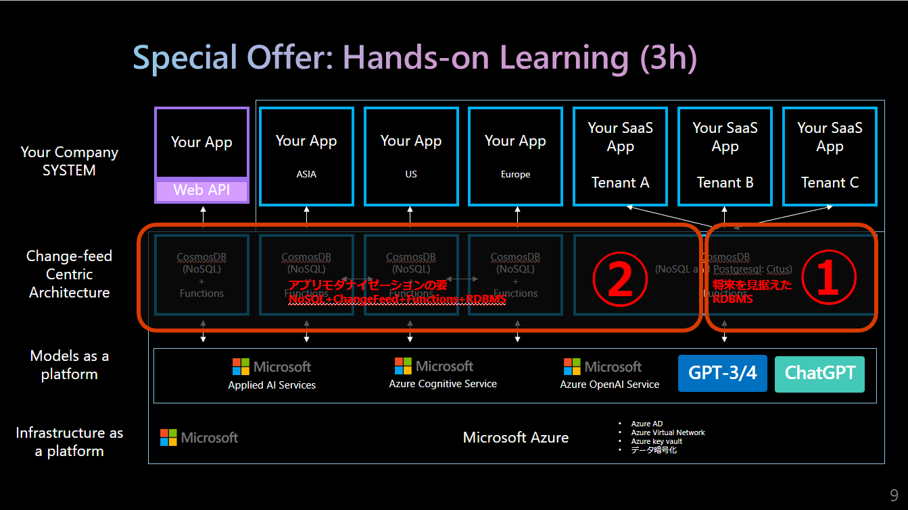

# Cosmos DB for NoSQL 概要 + Change Feedに関するHands On

> 本リポジトリではCosmos DB for **NoSQL**を中心に取り扱う。 
> その他のCosmos DB APIについての説明は[公式ドキュメント](https://learn.microsoft.com/ja-jp/azure/cosmos-db/)を参照のこと

本リポジトリの内容は下図の②に相当する。  

# 目次

※表記された時間は目安

1. [Cosmos DB for NoSQL 概要](https://github.com/tahayaka-microsoft/CosmosDB_NoSQL_Essentials/blob/main/00_CosmosDB_Essential.md) (1.5hour) ※別のリポジトリに移動
1. [Cosmos DB for NoSQLの操作](https://github.com/tahayaka-microsoft/CosmosDB_NoSQL_Essentials/blob/main/01_CreateAndOperationBasic_CosmosDB.md) (1hour)※別のリポジトリに移動
1. [Cosmos DB Change Feed 概要](./02_ChangeFeed_Essential.md) (30min)
1. [Azure Functionsを利用したCosmos DB Change Feedの操作](./03_ChangeFeed_OperationBasic.md) (1.5hour)
